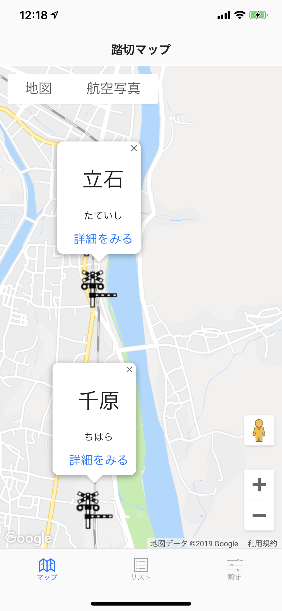
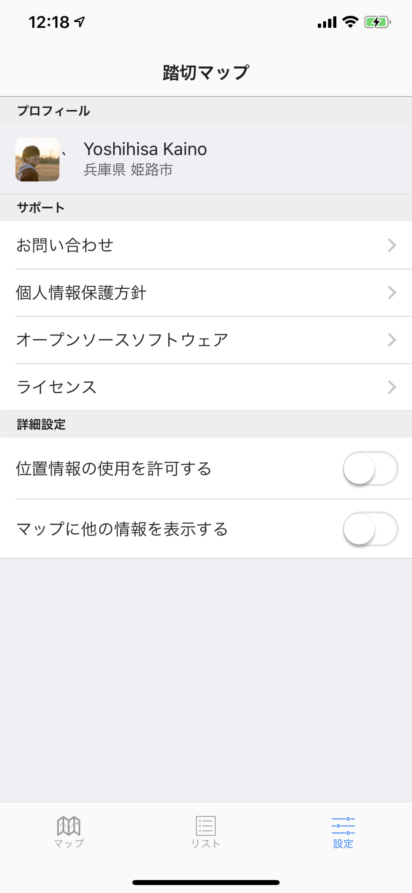
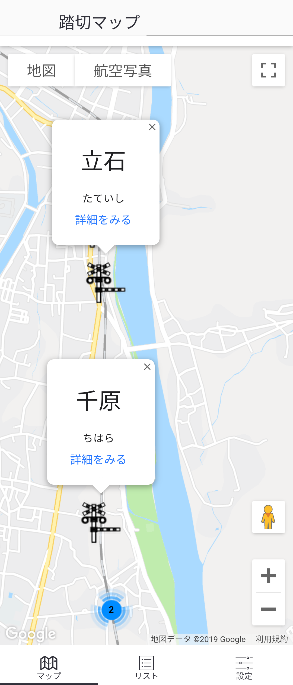
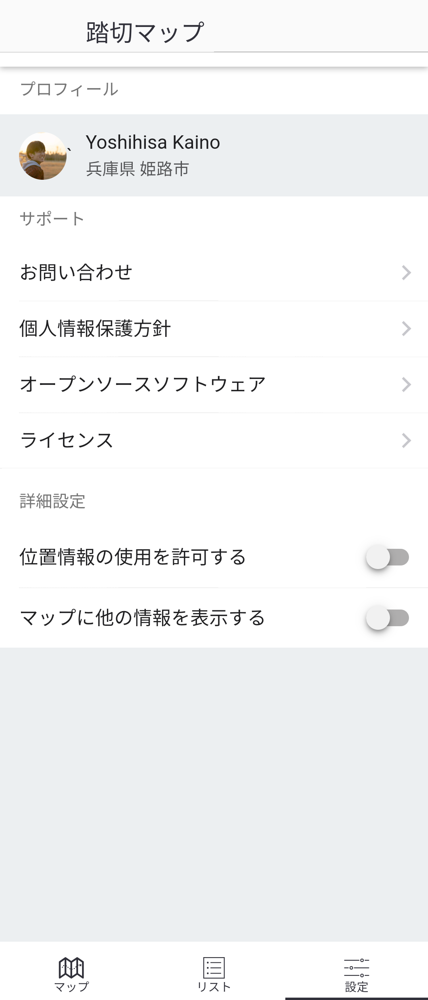
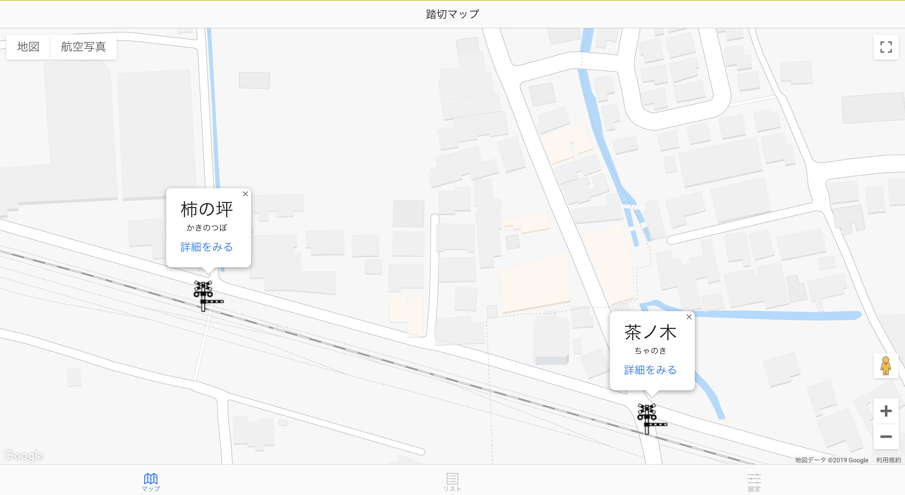

# [踏切マップ](https://rc-map.netlify.com/www/index.html)

[](https://app.netlify.com/sites/rc-map/deploys)


## イメージ (Last Update: 2019/05/20)

### iOS (iPhoneXsMax)
 

### Android (XPERIA10)
 

### ブラウザ (Chrome for Mac)


## 開発環境
- Apache Cordova
- Onsen UI
- HTML
- SCSS
- JavaScript

## 対応OS
- Android
- iOS
- ブラウザ(PWA)

---

## 実行方法

gitからcloneします。

```
$ git clone <THIS_REPOSITORY_URL>
$ cd <THIS_REPOSITORY_NAME>
```

### ローカル

パッケージのインストールをします。

`npm`もしくは`yarn`を使用してください。

```
$ npm install
```

or

```
$ yarn install
```

#### browser

ブラウザを起動して確認をします。

```
$ cordova run dev
```

実行すると、ブラウザが開き確認できます。

#### iOS

iOSのエミュレータを起動して確認をします。

プロジェクトをビルドするためには、XCodeが必要となります。

コマンドライン用のXCodeをインストールするために以下のコマンドを実施します。

```
$ xcode-select --install
```

また、コマンドラインでXCodeのライセンスに同意するために、以下を入力します。

```
$ sudo xcodebuild -license
```

色々と聞かれますが、同意して下さい。

初回ビルドの際、XCodeのコンポーネントがインストールされないので、XCodeを起動し、コンポーネントをインストールします。

そして、iOSのエミュレータを起動し、動作確認をします。

```
$ cordova emulate ios
```

Podfileなどのインストールでも対応できるそうですが、あまり詳しくないため割愛します。

#### Android

Androidのエミュレータを起動して確認をします。

`homebrew`でJDKをインストールします。

```
$ brew cask install java
```

最新のJDKでないものが欲しい場合は、caskroomのバージョンを確認し、インストールします。
例を以下に記載します。

```
$ brew tap caskroom/versions
```

JDK7のインストール方法

```
$ brew cask install caskroom/versions/zulu7
```

パスの設定は忘れずに実施して下さい。

AndroidStudioをインストールします。

こちらもパスの設定は忘れずに実施します。

```
$ brew cask install android-studio
```

AVDを指定してエミュレータを起動します。

```
$ cordova emulate android
```

権限の関係でエラーとなるため、以下のコマンドを実施してから再度、ビルド→エミュレートします。

```
$ chmod +x /<THIS_REPOSITORY_NAME>/platforms/android/gradlew
```

### Docker

#### ビルド

```
$ docker build -t <THIS_APP_NAME> .
```

`.` はカレントディレクトリを示すものです。削除しないでください。

#### 実行

```
$ docker run -it <THIS_APP_NAME>
```

## 開発手順

### ローカル


#### SCSSのコンパイル

```
$ npm run scss
```

or 

```
$ yarn run scss
```

#### CSSのprefix

```
$ npx gulp
```

以下は動作確認ができていないため推奨しません。

```
$ npm run prefix
```

or 

```
$ yarn run prefix
```

#### 実行＋コンパイル

```
$ npm run test
```

or 

```
$ yarn run test
```

### Docker
